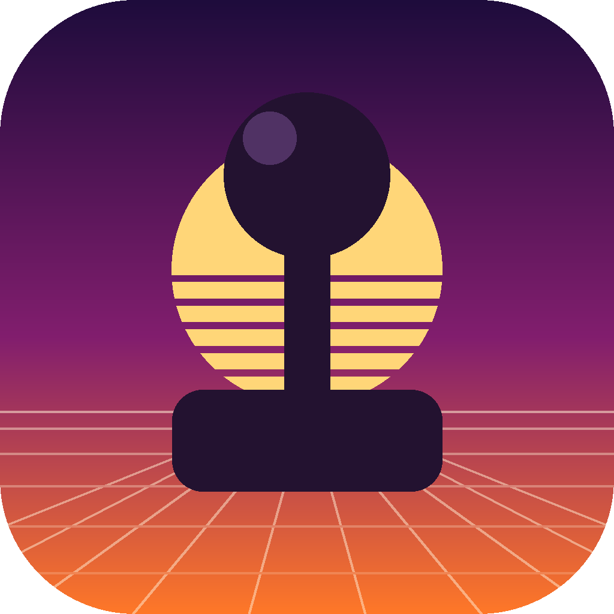

<div align="center">
  
# 🕹️ RetroArc
**The Ultimate Classic Game Engine for Apple Platforms**

[](https://apps.apple.com/)
[](https://apps.apple.com/)
[](https://apps.apple.com/)
[](#license)

[Download on the App Store](#) • [Features](#features) • [Installation](#building-from-source)

</div>

---

## ✨ About RetroArc

**RetroArc** is a meticulously crafted, premium retro game engine and emulator built specifically for the Apple ecosystem. Whether you are on an iPhone, an iPad, a Mac, or relaxing in the living room with your Apple TV, RetroArc provides a seamless, frictionless way to experience the golden age of gaming.

We believe that classic games deserve a modern home. That's why RetroArc abandons clunky, outdated emulator interfaces in favor of a gorgeous, glassmorphic UI, buttery-smooth metal-accelerated rendering, and true universal controller support.

<br/>


<br/>

## 🚀 Key Features

- **📺 Universal Apple Support:** Native applications compiled for iOS, iPadOS, macOS, and tvOS. One seamless codebase, tailored for every screen.
- **🎮 Ultimate Controller Integration:** Plug and play with your favorite Bluetooth controllers. Full native mapping for DualSense, Xbox Wireless, MFi, and more. 
- **⚡️ High-Performance Emulation:** Powered by modern emulation cores running under the hood, ensuring perfect frame rates, low latency, and accurate audio.
- **📁 Smart Library Manager:** Simply drop your legally owned ROMs into the app. RetroArc automatically organizes your collection into a beautiful, visual arcade grid.
- **💾 Save States Anywhere:** Never lose progress. Instantly save and load your exact game state at any moment.
- **🎨 Premium UI/UX:** A stunning dark-mode interface featuring dynamic blurs, haptic feedback, and fluid micro-animations.

## 🛠️ Building from Source

Want to contribute or build RetroArc yourself? The project is fully compatible with the latest versions of Xcode.

### Prerequisites
- macOS 13.0 or later
- Xcode 15.0 or later
- An active Apple Developer Account (for device provisioning)

### Quick Start
1. **Clone the repository**
   ```bash
   git clone https://github.com/yourusername/RetroArc.git
   cd RetroArc
   ```
2. **Open the project in Xcode**
   ```bash
   open "RetroArc - Game Emulator.xcodeproj"
   ```
3. **Configure Signing**
   - Select the `RetroArc` project in the Project Navigator.
   - Go to the **Signing & Capabilities** tab.
   - Select your personal or organization Development Team for all targets (iOS, macOS, tvOS).
4. **Build and Run (⌘R)**
   - Select your desired target simulator or connected device and hit Run.

## ⚖️ Legal Disclaimer

RetroArc is a game engine and emulator. **It does not include, endorse, or promote the downloading of copyrighted software.** Users are strictly required to provide their own legally obtained game backups (ROMs) to use this software. The developers of RetroArc hold no responsibility for how users choose to source their game files.

## 🤝 Contributing

We welcome contributions from the community! Whether it's adding new emulation cores, refining the UI, or fixing bugs, your help is appreciated. Please read our [Contributing Guidelines](CONTRIBUTING.md) before opening a pull request.

## 📄 License

RetroArc is distributed under the MIT License. See the `LICENSE` file for more information.

<br/>
<div align="center">
  <sub>Built with ❤️ for Retro Gamers everywhere.</sub>
</div>
